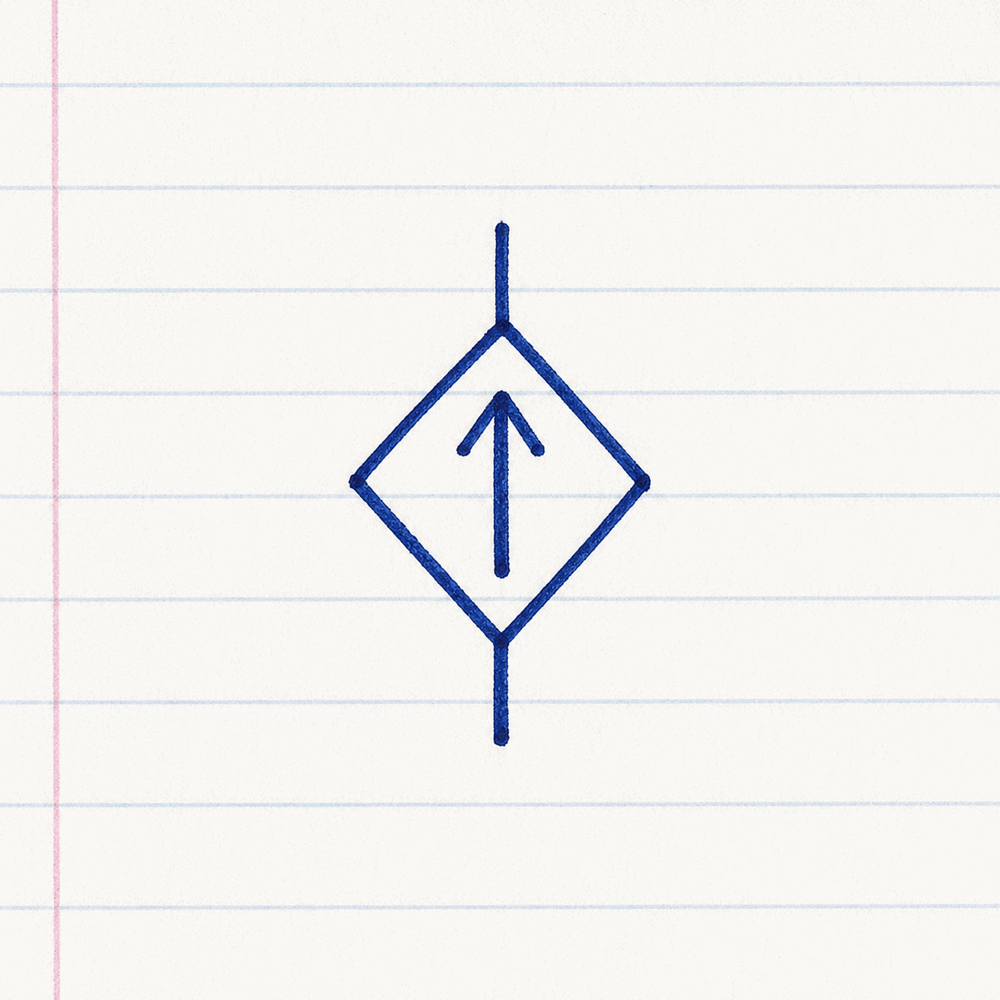
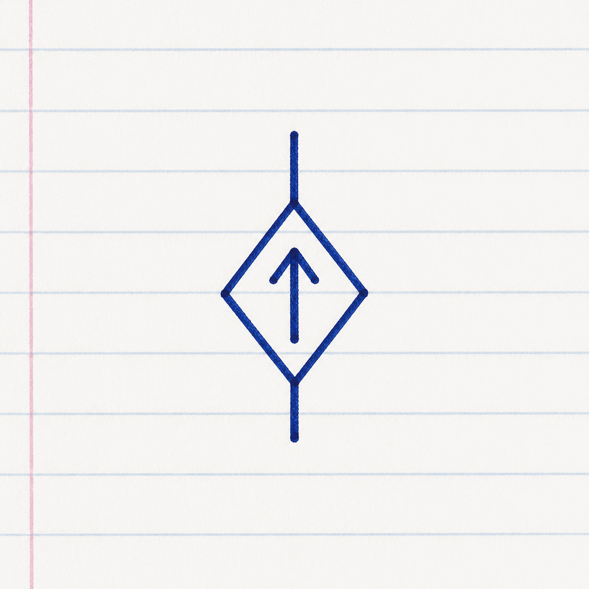
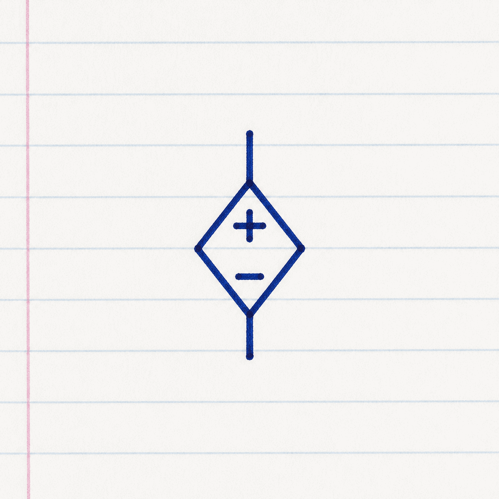
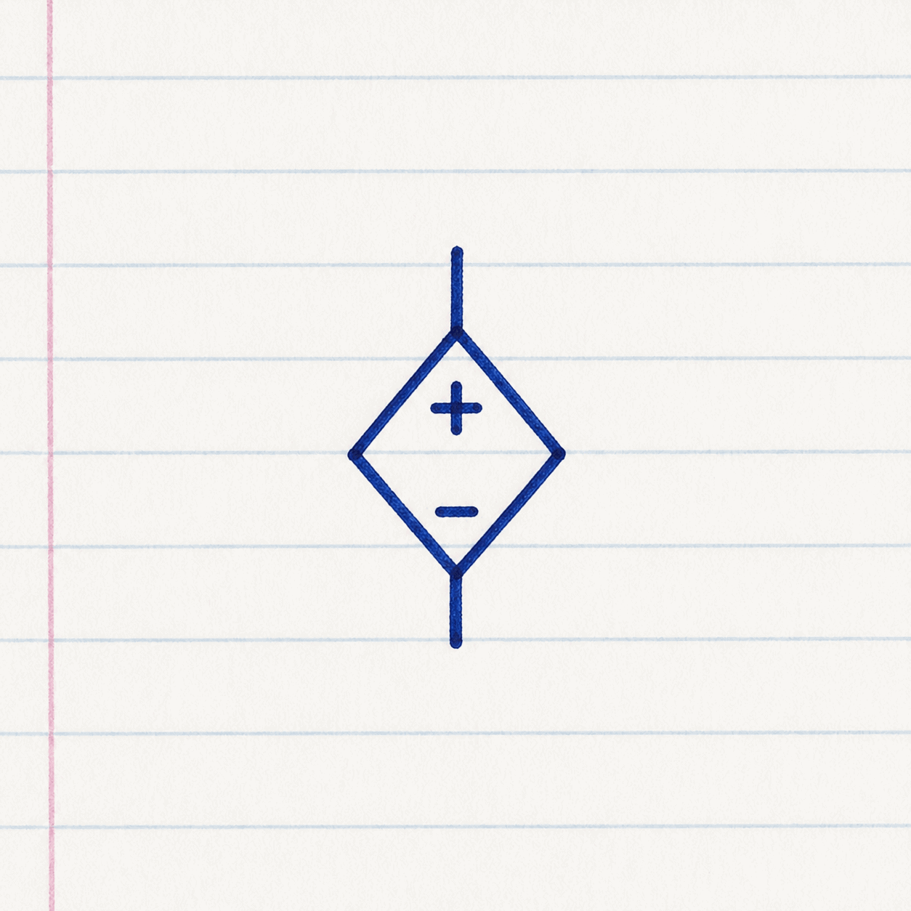
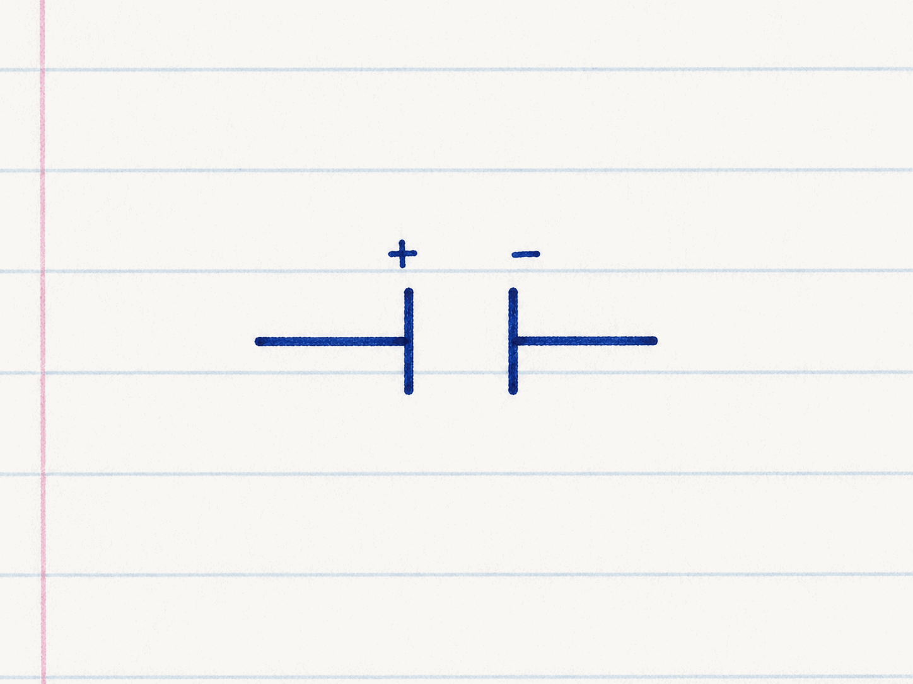

# BEE Class Log — 31 August 2026

## Source policy

This is the dated notebook record. Wording is preserved as far as it is safely readable; crossed-out corrections are normalized to the final written reading. The three original notebook photographs remain source/intake material and are not copied into normal website assets.

## Page 1 — Dependent sources

### Dependent sources

Dependent on voltage and current.

- VCCS — Voltage-Controlled Current Source
- CCCS — Current-Controlled Current Source
- CCVS — Current-Controlled Voltage Source
- VCVS — Voltage-Controlled Voltage Source

If the voltage/current of a source depends upon some other voltage/current in the network, it is called a dependent/controlled source.

Represented by a diamond symbol.

1. Voltage-Controlled Current Source (VCCS)

\[I=G_mV_c\]

2. CCCS

\[I=A_iI_c\]

3. CCVS

\[V=R_mI_c\]

4. VCVS

\[V=A_vV_c\]

## Page 2 — Passive elements: resistance and inductance

### Types of elements — Passive elements

#### 1) Resistance parameter

The property of a circuit element which opposes flow of current \(R\).

Unit: ohms (\(\Omega\))

\[R=\rho\dfrac{l}{A}\]

#### 2) Inductance parameter

The property of a circuit element to oppose the change in current \(L\).

Unit: henry (H)

The inductance of a coil is defined as the ratio of flux linkage to the current flowing through the coil.

\[L=\dfrac{N\phi}{i}\]

\(\phi\) = flux in weber  
\(N\) = number of turns  
\(i\) = current in amperes

\[L\dfrac{di}{dt}=v\]

\[i=\dfrac{1}{L}\int v\,dt\]

If the current across the inductor is constant, the inductor acts as a short circuit to DC.

## Page 3 — Capacitance

### 3) Capacitance parameter

Unit: farad (F)

Any two conducting surfaces separated by an insulating dielectric exhibit the property of capacitance. Conducting surfaces are known as electrodes. Insulating substance is known as dielectric.

\[q\propto v\]

\[q=Cv\]

\[\dfrac{dq}{dt}=C\dfrac{dv}{dt}\]

\[i=C\dfrac{dv}{dt}\]

\[v=\dfrac{1}{C}\int i\,dt\]

If the voltage across a capacitor is constant, capacitor acts as an open circuit to DC, i.e. \(i=0\).
